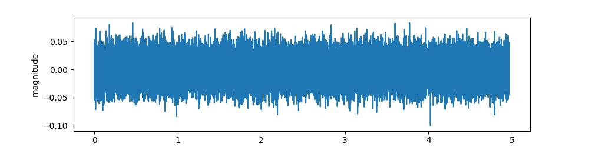

# Digital Voice Processing Final Project

# 实验原理
大部分单通道降噪算法都基于加性噪声模型。即假设采集到的语音信号为$y(t)$,其中纯净语音和噪声分别为$x(t)$ 和$n(t)$ ,
则它们之间满足:
$$
y(t)=x(t)+n(t)
$$

其频域的等效表示为
$$
Y(  \omega  )=|Y(  \omega  )  |e^ {j \Phi_{y}} (  \omega  )=X(  \omega  )+N(  \omega  )
$$

那么, 降噪问题就是在只知道$Y( \omega )$ 的前提下，结合语音信号的特点去恢复$X(  \omega  )$ 。
我们在实验三使用的谱减法就是最简单的一种降噪方法，其他的传统方法还有维纳(Wiener)滤波法。 或复杂一点基于信号的统计特性建模，包括 有最大似然(MaximumLikelihood, ML) 、贝叶斯(Bayesian)和最大后验(Maximum A Posteriori, MAP) 等几类方法。另外, 传统降噪中还有一类基于子空间的方法, 如使用奇异值分解(Singular Value Decomposition, SVD) 等。

我们这次实验将使用传统方法中最为常用的谱减法、维纳滤波法、基于贝叶斯准则的MMSE法(Minimum Mean Square Error, 最小均方误差)。并对它们进行比较。

## 谱减法
虽然在实验三中已经实现了谱减法，但是把它放到这里一是为了比较的完整性，另外，通过对比，得到公式的一般性，也是有必要的。
谱减法是在频域对混合信号的频谱和噪声的频谱做减法, 是一种思路很朴素的降噪方法，我们已经在实验三里实现。利用前述的加性噪声模型:
$$
	Y( \omega  )=|Y(  \omega  )  |e^ {j \phi_y(\omega ) } =X(  \omega  )+N(  \omega  )=X(  \omega  )+|N( \omega  )  |e^ {j \phi_n(\omega )}
$$
其中, $|N( \omega  )|$ 和$\phi_n$, 分别是噪声的幅度谱和相位谱。在实际应用中, 噪声的幅度谱$|N( \omega  )|$ 相对比较容易估计, 而噪声的相位谱$\phi_n$,则比较难估计。如果假设$X(  \omega  )$ ,$Y(\omega)$ 和 $N(\omega)$ 的相位均一致, 则可以得到:
$$\hat{X}(\omega)=Y(\omega)-N(\omega) \approx[|Y(\omega)|-|\hat{N}(\omega)|] \mathrm{e}^{j \Phi_{y}(\omega)}$$
这样, 只需要得到噪声的幅度谱估计 $|\hat{N}(\omega)|$, 便可得到干净语音的频谱并恢复时域 波形。噪声幅度谱的估计方法有很多种。比如, 对于平稳噪声可以结合 VAD, 根据 没有语音的片段的总能量来计算噪声的幅度谱。而对于非平稳噪声, 可以通过结合 语音存在概率的噪声估计算法对噪声能量进行跟踪, 具体将在 3.3.3 节中介绍。在这里, 暂时先假设噪声幅度谱已知。在实际应用中, 由于语音和噪声的相位谱存在差异, 谱减法估计的语音幅度谱 $|Y(\omega)|-|\hat{N}(\omega)|$ 可能小于 0 , 因此需要一些修改。
$$\hat{X}(\omega)=\left\{\begin{array}{ll}
{[|Y(\omega)|-|\hat{N}(\omega)|] \mathrm{e}^{j \Phi_{y}(\omega)},} & |Y(\omega)|>|\hat{N}(\omega)| \\
0, & \text { 其他 }
\end{array}\right.$$
将上式中的上半部分换一种形式, 得到:
$$\hat{X}(\omega)=Y(\omega)\left(1-\frac{|\hat{N}(\omega)|}{|Y(\omega)|}\right)=Y(\omega) H(\omega)$$
其中, $H(\omega)=1-\frac{|\hat{N}(\omega)|}{|Y(\omega)|}$ 被称为增益函数或抑制函数, 它可以被看作一个线性系统 的系统函数。不过，在语音增强的场景中，由于相位谱不易估计, 该函数通常是一 个实函数。
以上幅度谱减法的前提是假设语音与噪声的相位谱一致, 在实际中这可能会在 降噪结果里引入较大的失真。为了解决这个问题, 幅度谱减法又被拓展为功率谱减 法。回到之前的加性噪声模型, 如果考虑混合信号的功率谱, 则有
$$|Y(\omega)|^{2}=|X(\omega)|^{2}+|N(\omega)|^{2}+X^{*}(\omega) N(\omega)+X(\omega) N^{*}(\omega)$$
这次做出的假设是语音与信号不相关, 即 $X^{*}(\omega) N(\omega)=X(\omega) N^{*}(\omega)=0$, 则可以得 到如下的功率谱减公式:
$$|\hat{X}(\omega)|^{2}=|Y(\omega)|^{2}-|\hat{N}(\omega)|^{2}$$
同样的, 这里只需要噪声的幅度谱估计 $|\hat{N}(\omega)|$, 便可得到干净语音的频谱并恢复时域波形。由此得到, 功率谱减法的增益函数为

$$H(\omega)=\sqrt{1-\frac{|\hat{N}(\omega)|^{2}}{|Y(\omega)|^{2}}}$$

不难发现，我们可以通过一种统一的形式来描述以上两种方法:

$$\hat{X}(\omega)=Y(\omega)H(\omega)$$

这就是谱减法的一般形式, 其中幅度谱减法对应 $p=1$, 而功率谱减法对应 $p=2$ 。 对于相同的 $|Y(\omega)|$ 和 $|\hat{N}(\omega)|$ ，由不同的 $p$ 值得到的增益函数所对应的衰减量是不一 样的, $p$ 值越小衰减量越大。

事实上, 该流程不仅适用于谱减法, 也适用于绝大多数传统单通道降噪方法, 只是其中增益计算的方式可能会有所不同。因为传统方法都是通过一个滤波器来实现的。 给出了谱减法的一般流程，当然也能表示很多其他方法。


## 改进的谱减法(过减法)

当使用谱减法时，如果带噪语音的幅度谱与估计出来的噪声谱相减出现负值时，说明对噪声的估计出现了过估计问题。谱减法中采取了最简单的处理就是将负值重调为0。但是，这种对负值的非线性处理，会导致信号帧频谱的随机位置上出现小的、独立的峰值。转换到时域后，这些峰值听起来就像帧与帧之间频率随机变化的多频音，这种现象在清音段会更加明显。这种由于半波整流引起的“噪声”被称为“音乐噪声”。

 谱减法的另一个较小的缺点是使用带噪信号相位，因此可能产生比较粗糙的语音质量。由于要估计纯净语音语音的相位很困难，并将极大地增加算法的复杂度。与幅度谱噪声相比，相位噪声带来的语音失真并不是很大，尤其是在高信噪比条件下。因此，使用带噪语音相位被认为是一个可以接受的方案。解决音乐噪声问题更重要。因此谱减法的缺点有如下几点：

- 谱减中的负数部分进行了非线性处理
- 对噪声谱的估计不准
- 抑制函数（增益函数）具有较大可变性
 

减小音乐噪声的方法是对谱减的负值设置一个下限，而不是将它们设为0。该下限的取值根据相邻帧的最小谱值确定。因为对噪声的估计需要确定无语音段（或低能量段），需要用到后续帧的语音谱，因此不可能满足实时应用。
谱减法的半波整流 (小于0，置0) 方法，会引入音乐噪声，为了减少音乐噪声，将满足条件的频点不设置为 0 ，而是设置为相邻几帧的最 小值。
$$
|\widehat{X_i}(w)|=\left\{ 
    \begin{array}{lc}
        |Y_i(w)|-|\widehat{N}(w)|, \text { 如果 }|Y_i(w)|-|\widehat{ N}(w)|>\max | \widehat{N}(w) \mid \\
        min _{j=i-1: i+1}|\widehat{X_j}(w)|, \text { 其它 }\\
    \end{array}
\right.
$$


该方法需要末来一帧的数据，不能做到实时更新，为了解决这个问题，Berouti提出来一种不需要末来信息的方法，该方法包括减去噪声 谱的过估计和设定最小值保护，形式如下:
$$
|\widehat{X}(w)|=\left\{\begin{array}{l}
|Y(w)|-\alpha |\widehat{N}(w)|, \text { 如果 }|Y(w)|>(\alpha+\beta) \widehat{N}(w) \mid \\
\beta|\widehat{N}(w)|, \text { 其它 }
\end{array}.
\right.
$$
其中 $\alpha$ 为过减因子（大于等于1），$\beta$（大于0小于等于1）是谱下限参数。
 
使用过减因子与谱下限的动机在于：当从带噪语音谱中减去噪声谱估计的时候，频谱中会残留一些隆起的部分或谱峰，有些谱峰是宽带的，有些谱峰很窄，看起来像是频谱上的一个脉冲。通过对噪声谱的过减处理，我们可以减小宽带谱峰的幅度，有时还可以将其完全消除。
 
但是仅仅这样还不够，因为谱峰周围可能还存在较深的谱谷。因此需要使用谱下限来“填充”这些谱谷。因此，参数 $\beta$ 可以控制残留噪声的多少以及音乐噪声的大小。

## 维纳滤波法
维纳滤波是另一类广泛适用的基础降噪方法。和谱减法的思想不同, 维纳滤波 是线性系统的一个经典概念, 它的出发点是从最小均方误差的角度来推导误差最小 的线性系统。
最开始在做实验三的时候，我选择了谱减法而不是维纳滤波，因为我觉得维纳滤波涉及到了一个非因果性，需要先知道真实$X(\omega)$才能推导误差最小，而没有实现。

后来这次实验的时候，我才发现了玄妙。这里可以将降噪问题看作一个线性系统, 系统的输入是带噪信号 $Y(\omega)$, 输出是 $Y(\omega) H(\omega)$, 而我们期望的目标是使系统的输出与 $X(\omega)$ 的误差最小。维纳 滤波法有时域和频域推导两种方式。由于语音降噪大多数在频域进行, 因此这里我 们只关心频域方式的推导。设系统的输出为
$$
    \hat{X}(\omega)=Y(\omega) H(\omega)
$$
维纳滤波法的目标是使如下均方误差最小:
$$
	E[|e(  \omega  )  |^ {2}  ]=E\{[X(  \omega  )-Y(  \omega  )H(  \omega  )][X(  \omega  )-Y(  \omega  )H(  \omega  )]^*\}
$$
这是一个优化问题, 最优的$H(  \omega  )$ 为
$$
H(  \omega  )=arg  \min  E[|e(  \omega  )  |^ {2} ]
$$
将以上的均方误差对$H(  \omega  )$求偏导数:
$$
	\frac {\partial E[|e(\omega )|^ {2}]}{\partial H(\omega )}  =H(  \omega  )^* E[|  Y   (\omega )|^ {2}]-E[Y(  \omega  )X(  \omega  )^*]
$$
对以上偏导数求极值得到:
$$
    H(  \omega  )=  \frac {E[X(\omega )Y(\omega )^*]}{E[|Y(\omega )|^ {2}]}  =  \frac {P_ {xy}}{P_ {yy}}  
$$
其中,  $P_ {xy}$  是干净语音和带噪语音的互功率谱,  $P_ {yy}$  是带噪语音的功率谱。若假设语音和噪声不相关,即$E[X(  \omega  )N(  \omega  )^*]=0$,则
$$
    H(  \omega  )=  \frac  {E[X(  \omega  )Y(  \omega  )^*]}{E[|Y  (\omega )|^ {2}  ]}=  \frac  {E[X(  \omega  ) X(  \omega  )^*+X(  \omega  )N(  \omega  )^*]}{E[|Y  (\omega )|^ {2}  ]}|
    =  \frac  {E[|X  (\omega )^ {2} ] }{E[|Y  (\omega )|^ {2}  ]}|=  \frac {P_ {xx}}{P_ {yy}} 
$$
同样的, 在语音和噪声不相关的假设下:
$$
        P_ {yy}  =E[|Y  (\omega )|^ {2}  ]
    =E\{[X(  \omega  )+N(  \omega  )][X(  \omega  )+N(  \omega  )]^*\}
    =E[|X  (\omega )|^ {2}] +E[|N(  \omega  )|^2]
    =  P_ {xx}  +  P_ {dd}  
$$
因此可得:
$$
    H(  \omega  )=  \frac {P_ {xx}}{P_ {yy}}  =1-  \frac {P_ {dd}}{P_ {yy}}  
$$
在实际应用中，通常可用$|\hat{N}(\omega)|^{2}$作为$P_{dd}$的估计，用$|Y(\omega)|^{2}$作为$P_{yy}$的估计。我们可以发现，维纳滤波法与幅度谱减法有相同的实现形式。

## 改进的维纳滤波
考虑到非因果性，我进行了探究，发现还有维纳滤波的改进方法。利用迭代思想去近似求解维纳滤波的非因果解，是用因果系统去实现非因果维纳滤波的一种方式。其基本思想为：先用带噪语音去初始化增强语音，然后计算得到增益函数，并利用对带噪语音进行滤波，得到新的增强信号，随后重复计算增益函数，再对带噪语音进行滤波，得到新的增强语音，如此迭代数次后的增益函数值即为所求。
迭代维纳滤波器假设声道系统在域具有如下全极点形式:
$$
    V(z)=\frac{g}{A(z)}=\frac{g}{1-\sum_{k=1}^p a_k z^{-k}}
$$
其中， $g$ 为系统增益； $\left\{a_k\right\}$ 为全极点系数； $p$ 为全极点个数。在时域，语音信号 $\{x(n)\}$ 通过下面的 差分方程得到:
$$
    x(n)=\sum_{k=1}^p a_k x(n-k)+g \cdot w(n), \quad n=0,1, \ldots, N-1
$$
其中 $w(n)$ 为系统的输入激励。假设 $w(n)$ 为具有零均值和单位方差的高斯白噪声，可以将上式精简 为:
$$
    x(n)=\mathbf{a}^T \mathbf{x}_p+g \cdot w(n)
$$
其中 $a^T=\left[a_1, a_2, \ldots, a_p\right] $，$ x_p^T=[x(n-1), x(n-2), \ldots, x(n-p)]$ 。
则:
$$
    \begin{aligned}
    y(n) & =x(n)+d(n) \\
    & =\mathbf{a}^T \mathbf{x}_p+g \cdot w(n)+d(n)
    \end{aligned}
$$

在确定了模型假设后，开始估计模型参数。
使用最大后验MAP (maximum a posteriori) 去估计参数，在观测到带噪语音信号条件下，对得 到参数a的概率 $p(a \mid y)$ 最大化。具体过程比较复杂参考，可以得到$g^2$如下:
$$
    g^2=\frac{\frac{2 \pi}{N} \sum_{n=0}^{N-1} y^2(n)-2 \pi \sigma_d^2}{\int_{-\pi}^\pi \frac{1}{\left|1-\sum_{k=1}^p a_k e^{-j k \omega}\right|^2} d \omega}
$$
因此迭代维纳滤波器算法实践步骤如下:

- 首先使用带噪信号初始化信号的初始值，即设 $x_0=y$ ，设置迭代次数 $\mathrm{i}=0,1,2 \ldots$ 执行以下步骤
-  在第$i$次迭代中对于给定的估计信号 $x_i$ ，利用线性预测技术计算全极点系数 $a_i$ 。
- 根据上式计算增益项 $g^2$ 。
-  计算 $x_i$ 的短时功率谱:
$$
P_{x_i x_i}(\omega)=\frac{g^2}{\left|1-\sum_{k=1}^p a_i(k) e^{-j k \omega}\right|^2}
$$
其中 $a_i(k)$ 是步骤一估计出的系数。
- 计算维纳滤波器
$$
H_i(\omega)=\frac{P_{x_i x_i}(\omega)}{P_{x_i x_i}(\omega)+\sigma_d^2}
$$

- 估计增强后的信号谱:
$$
X_{i+1}(\omega)=H_i(\omega) Y(\omega)
$$
- 回到步骤2，使用步骤6估计到的 $X_{i+1}(w)$ 作为估计信号。重复上述步骤，直到迭代结 束。
迭代结束。


记录迭代维纳滤波并不是因为其效果好，而是其提供了一个新求解维纳滤波的思路，内部包含了一种噪声估计的方法。
但是就理论来说，语音增强领域的迭代维纳滤波器有一大缺陷：迭代何时结束？目前研究还不清楚用什么收敛条件，不知道何时收敛。因为实验方面这个方法效果似乎并不理想，且实现起来较为困难，因此我们只研究了实验原理，并没有实现。

## 基于贝叶斯准则的MMSE
贝叶斯方法使用先验知识，理论效果比最大似然方法好。最大后验方法寻找的是后验概率分布最大后验方法寻找的是后验概率分布 $p(X(\omega) \mid Y(\omega))$的最大值。对一个单峰且对称的分布而言 (如高斯分布)，最大后验和贝叶斯方法是等价的。然而在某些场景中，如果信号的分布难以做出假设，使用最大后验方法往往比使用贝叶斯方法要简单一些，因为一个末知分布的最大值通常要比其均值更容易获取。
我们这里使用了先验知识即采用贝叶斯准则。
### 贝叶斯准则下的 MMSE 和维纳滤波的区别

- 维纳滤波法有线性假设, 即认为干净语音和带噪语音之间存在线性关系: $X(\omega)=Y(\omega) H(\omega)$ 。而贝叶斯降噪没有这一假设, 完全通过统计特性来求解干净语 音的最优估计 $\hat{X}(\omega)$, 但是这里需要对语音信号的概率分布做出另外的假设。
- 维纳滤波法寻找的是复数谱意义上的最优解，即最优的 $X(\omega)$ 。下面我们 寻找幅度谱上的最优解, 即最优的 $|X(\omega)|$ 。

### MMSE
定义基于幅度谱的 MMSE 优化目标:
$$
    e=E[\left(\hat{X}_k-X_k\right)^2]
$$
为了表述简洁, 这里令 $\hat{X}_k=\left|\hat{X}\left(\omega_k\right)\right|$, 即估计的干净语音在第 $k$ 个频点上的幅度。
MMSE 估计器的目标是使每个频点的幅度与真实幅度之间的平方误差的数学期望最小。另外, 令 $\boldsymbol{Y}=[Y\left(\omega_1\right), Y\left(\omega_2\right), \cdots, Y\left(\omega_N\right)]$, 表示带噪信号在所有频点上的频谱, 那么在贝叶斯 MSE 准则下, 该数学期望需要通过 $X_k$ 与 $\boldsymbol{Y}$ 之间的联合概率密度函数 $p\left(X_k, \boldsymbol{Y}\right)$ 来求解, 即
$$
e=\iint\left(\hat{X}_k-X_k\right)^2 p\left(X_k, \boldsymbol{Y}\right) \mathrm{d} \boldsymbol{Y} \mathrm{d} X_k
$$
使上式最优的 $\hat{X}_k$ 为
$$
\hat{X}_k=\int x_k p\left(x_k \mid \boldsymbol{Y}\right) \mathrm{d} x_k=E[X_k \mid \boldsymbol{Y}]
$$

也就是说最优解就是 $X_k$ 在条件 $\boldsymbol{Y}$ 下的后验数学期望, 或者说是后验概率密度函 数 $p\left(x_k \mid \boldsymbol{Y}\right)$ 在全体 $x_k$ 上的均值。
为了求解这个问题, 需要做出两点假设: (1)假设语音信号的频谱（实部和虚部）分别都满足均值为0的高斯分布；(2)假设语音信号的频谱在各个频点之间不相关。
这两点假设事实上都是极大简化的, 因为实际的语音信号往往并不满足这两个条件, 但是基于这两个假设得到的降噪方法在试验中被证明是有效的, 故这里先不去过多探讨它们的合理性。基于第二点假设，问题变为
$$
    \hat{X}_k=E[X_k \mid Y(\omega)]=\int x_k p\left(x_k \mid Y(\omega)\right) \mathrm{d} x_k=\frac{\int x_k p\left(Y(\omega) \mid x_k\right) p\left(x_k\right) \mathrm{d} x_k}{p\left(Y(\omega) \mid x_k\right) p\left(x_k\right) \mathrm{d} x_k}
$$
上面等式的最后一步是由贝叶斯条件概率定律推导得出的。求解该式的关键问题是 $p\left(Y(\omega) \mid x_k\right)$, 也就是在 $x_k$ 条件下 $Y(\omega)$ 的条件概率。根据前述第一点假设, $Y(\omega)$ 可 以被认为是 $X(\omega)$ 和 $N(\omega)$ 两个高斯分布随机变量的和, 那么这个条件概率 $p\left(Y(\omega) \mid x_k\right)$ 依然是满足高斯分布的, 并且其均值是 $X(\omega)$, 而方差是 $N(\omega)$ 的方差,
$$
    p\left(Y(\omega) \mid x_k\right)=\frac{1}{\pi \lambda_d(k)} \exp \left(-\frac{1}{\lambda_d(k)}|Y(\omega)-X(\omega)|^2\right)
$$
其中, $\lambda_d(k)=E[\left|N\left(\omega_k\right)\right|^2]$ 为第 $k$ 个频点上的噪声功率谱的期望。此外, $p\left(x_k\right)$ 也满 足高斯分布, 即
$$
    p\left(x_k\right)=\frac{1}{\pi \lambda_x(k)} \exp \left(-\frac{x_k^2}{\lambda_x(k)}\right)
$$
其中, $\lambda_x(k)=E[\left|X\left(\omega_k\right)\right|^2]$ 为第 $k$ 个频点上的语音功率谱的期望。将以上两个概 率分布代入前述积分公式, 进行化简后可得贝叶斯 MMSE 估计器的最终计算方法 (过程略):
$$
    \hat{X}_k=\sqrt{\lambda(k)} \Gamma(1.5) \Phi\left(-0.5,1 ;-v_k\right)
$$
其中， $\Gamma$ 和 $\Phi$ 分别表示伽马 (Gamma) 函数和合流超几何 (Confluent Hypergeometric) 函数, 其定义分别为
也就是说最优解就是 $X_k$ 在条件 $\boldsymbol{Y}$ 下的后验数学期望, 或者说是后验概率密度函 数 $p\left(x_k \mid \boldsymbol{Y}\right)$ 在全体 $x_k$ 上的均值。
为了求解这个问题, 需要做出两点假设: (1)假设语音信号的频谱（实部和虚部）
这两点假设事实上都是极大简化的, 因为实际的语音信号往往并不满足这两个 条件, 但是基于这两个假设得到的降噪方法在试验中被证明是有效的, 故这里先不 去过多探讨它们的合理性。基于第二点假设，问题变为
$$
    \hat{X}_k=E[X_k \mid Y(\omega)]=\int x_k p\left(x_k \mid Y(\omega)\right) \mathrm{d} x_k=\frac{\int x_k p\left(Y(\omega) \mid x_k\right) p\left(x_k\right) \mathrm{d} x_k}{p\left(Y(\omega) \mid x_k\right) p\left(x_k\right) \mathrm{d} x_k}
$$

上面等式的最后一步是由贝叶斯条件概率定律推导得出的。求解该式的关键问题是 $p\left(Y(\omega) \mid x_k\right)$, 也就是在 $x_k$ 条件下 $Y(\omega)$ 的条件概率。根据前述第一点假设, $Y(\omega)$ 可 以被认为是 $X(\omega)$ 和 $N(\omega)$ 两个高斯分布随机变量的和, 那么这个条件概率 $p\left(Y(\omega) \mid x_k\right)$ 依然是满足高斯分布的, 并且其均值是 $X(\omega)$, 而方差是 $N(\omega)$ 的方差,
$$
    p\left(Y(\omega) \mid x_k\right)=\frac{1}{\pi \lambda_d(k)} \exp \left(-\frac{1}{\lambda_d(k)}|Y(\omega)-X(\omega)|^2\right)
$$
其中, $\lambda_d(k)=E[\left|N\left(\omega_k\right)\right|^2]$ 为第 $k$ 个频点上的噪声功率谱的期望。此外, $p\left(x_k\right)$ 也满 足高斯分布, 即
在
$$
    p\left(x_k\right)=\frac{1}{\pi \lambda_x(k)} \exp \left(-\frac{x_k^2}{\lambda_x(k)}\right)
$$
其中, $\lambda_x(k)=E[\left|X\left(\omega_k\right)\right|^2]$ 为第 $k$ 个频点上的语音功率谱的期望。将以上两个概 率分布代入前述积分公式, 进行化简后可得贝叶斯 MMSE 估计器的最终计算方法:
$$
    \hat{X}_k=\sqrt{\lambda(k)} \Gamma(1.5) \Phi\left(-0.5,1 ;-v_k\right)
$$
其中， $\Gamma$ 和 $\Phi$ 分别表示伽马 (Gamma) 函数和合流超几何 (Confluent Hypergeometric) 函数, 其定义分别为
$$
    \begin{gathered}
    \Gamma(x)=\int_0^{\infty} t^{x-1} \mathrm{e}^{-t} \mathrm{~d} t \\
    \Phi(a, b ; z)=1+\frac{a}{b} \frac{z}{1 !}+\frac{a(a+1)}{b(b+1)} \frac{z}{2 !}+\frac{a(a+1)(a+2)}{b(b+1)(b+2)} \frac{z}{3 !}+\cdots
    \end{gathered}
$$
而 $\lambda_k$ 和 $v_k$ 分别为
$$
    \begin{gathered}
    \lambda_k=\frac{\lambda_x(k) \lambda_d(k)}{\lambda_x(k)+\lambda_d(k)}=\frac{\lambda_x(k)}{1+\xi_k} \\
    v_k=\frac{\xi_k}{1+\xi_k} \gamma_k
    \end{gathered}
$$
其中, $\xi_k=\xi\left(\omega_k\right)$ 为先验信噪比, $\gamma_k=\gamma\left(\omega_k\right)$ 为后验信噪比。在实际应用中, 先验信噪比较难直接获取, 通常使用当前帧的后验信噪比减去 1 , 然后再与上一帧信噪比估计进行平滑处理, 作为当前帧的先验信噪比估计。 形式:
$$
    \hat{X}_k=H_{\mathrm{MMSE}} Y_k
$$
而
$$
    H_{\text {MWSE }}=\frac{\sqrt{\pi}}{2} \frac{\sqrt{v_k}}{\gamma_k} \exp \left(-\frac{v_k}{2}\right)[\left(1+v_k\right)] I_0\left(\frac{v_k}{2}\right)+v_k I_1\left(\frac{v_k}{2}\right)
$$
就是贝叶斯 MMSE 估计器的增益函数, 其中 $I_0(x)$ 和 $I_1(x)$ 分别为零阶和一阶修正贝塞尔函数 (Modified Bessel Function)。其定义由下式给出:
$$
    I_v(x)=j^{-v} J_v(j x)=\sum_{m=0}^{\infty} \frac{x^{v+2 m}}{2^{v+2 m} m ! \Gamma(v+m+1)}
$$


其中, $j \hat{\theta}_{x k}$ 为第 $k$ 个频点所估计的相位。对上式使用拉格朗日乘子法进行求解后可 得最优的 $j \hat{\theta}_{x k}$ 为
$$
    j \hat{\theta}_{x k}=j \theta_{y k}
$$
其中, $j \theta_{y k}$ 为带噪语音在第 $k$ 个频点上的相位。也就是说, 在前述两个假设下, 最佳相位的贝叶斯 MMSE 估计就是带噪语音的相位。这一结论也为在一般的语音降噪 算法中只处理幅度而直接使用带噪语音相位的做法提供了理论支撑。

### log-MMSE
使用 MMSE 作为标准的最优化方法, 虽然在数学上完全成立并且也比较容易处 理, 然而如果考虑到人耳的听觉特性, 正如老师上课讲的一样，因为人耳对音量的感知和音频信号的能量之间并非线性, 而是接近对数的关系, 所以 MMSE 准则在主观听感上并不一定是最优解。


语音信号的动态范围相当宽, 高能量和低能量之间往往有数量级的差异。这种 差异会使得低能量段产生的误差对整体误差的贡献非常低, 几乎可以被忽略, 然而 低能量段中的这些很小的误差却可以被人耳感知到。针对这个问题, 需要提出一种 更符合人耳听觉特性的准则函数, 使数学计算和主观听感匹配起来。一个比较典型 和常用的准则函数是对数 MMSE (log-MMSE)。它通过将信号的幅度谱变换到对数 域, 压缩了其动态范围, 使得低能量段和高能量段对整体误差的贡献更为均衡。 log-MMSE 的误差函数定义如下:

$$
    e=E\left\{[\log \left(\hat{X}_k\right)-\log \left(X_k\right)]^2\right\}
$$
我们可以从另一个角度来看这个定义。因为
$$
    \log \left(\hat{X}_k\right)-\log \left(X_k\right)=\log \left(\frac{\hat{X}_k}{X_k}\right)
$$
所以优化误差函数事实上是在优化估计的语音幅度谱与真实的语音幅度谱之间的比 值, 并且其目标是达到 1 , 这样得到的误差函数为 0 。
采用与 MMSE 估计器同样的思路, log-MMSE 估计器的最优解为
$$
    \hat{X}_k=\exp \left(E[\log \left(X_k\right) Y]\right)
$$
使用与 MMSE 估计器相同的假设与类似的求解思路, 可以得到以下闭式解 (过程略)
$$
    E[\log \left(X_k\right) \mid \boldsymbol{Y}]=\frac{1}{2}\left(\log \lambda_k+\log v_k+\int_{v_k}^{\infty} \mathrm{e}^{-t} \mathrm{~d} t\right)=\frac{1}{2}\left(\log \lambda_k+\log v_k-E i\left(-v_k\right)\right)
$$

其中, $\lambda_k$ 和 $v_k$ 已在 MMSE 估计器的推导过程定义, 而 $E i(x)$ 为指数积分 Integral。
$$
    E i(x)=-\int_{-x}^{\infty} \frac{\mathrm{e}^{-t}}{t} \mathrm{~d} t
$$
最后, 对 $E[\log \left(X_k\right) \mid \boldsymbol{Y}]$ 求指数可得
$$
    \hat{X}_k=\exp \left(E[\log \left(X_k\right) \mid \boldsymbol{Y}]\right)=\frac{\xi_k}{\xi_k+1} \exp \frac{-E i\left(-v_k\right)}{2} Y_k=H_{\log -MMSE} Y_k
$$
其中
$$
    H_{\log -\mathrm{MMSE}}=\frac{\xi_k}{\xi_k+1} \exp \frac{-E i\left(-v_k\right)}{2}
$$
这就是 log-MMSE 估计器的增益函数。

通过对两组增益函数进行比较, 可以得知, 在相同的先验信噪比 $\xi_k$ 和后验信噪比 $\gamma_k$ 的前提下, log-MMSE 估计器的衰减量更大。而实验也表明, 和 MMSE| 相比, log-MMSE 估计器能够在更好地保持语音质量的前提下更多地抑制噪声,主观听感也更好。此外, 可以看到 log-MMSE 估计器的增益函数比 MMSE的更简洁。 因此, log-MMSE 估计器在实际场景中被更广泛地使用。


### Square-MMSE
前两种MMSE的方法计算都较为复杂，另一种square-MMSE的方法是为了计算简单，考虑估计纯净信号和真实纯净信号的，功率差的平方，以此作为目标进行优化。误差如下。
$$
    e=E\left[\left(\hat{X}^2_k-X_k^2\right)^2\right]
$$
同理可得：
$$
    H_k = \sqrt{\frac{\xi_k}{1+\xi_k}(\frac{1+v_k}{\gamma_k})}
$$
这就是 Square-MMSE 估计器的增益函数。它的优势在于计算简单。

## 实验设计
我们使用python实现以上各个方法。
实验代码的依赖如下：
``` yaml
dependencies:
  - python=3.10.9
  - matplotlib=3.7.1
  - scipy=1.10.1
  pip:
      - numpy==1.23.5
```


## 代码结构安排

WaveFile:一个用于读取和写入波形文件、存储音频元数据和导出音频数据帧进行处理和执行时域和频谱域时间的类。
FramedAudio:一个存储音频数据帧并对其执行操作的类
- dsp.spec\_sub\_gain：频谱减法
- dsp.wiener\_gain：维纳过滤器
- dsp.mmse\_stsa\_gain：贝叶斯MMSE
- dsp.logmmse\_gain：贝叶斯对数MMSE
- dsp.mmse\_sqr\_gain：贝叶斯平方MMSE
误差度量：
- wave.snr： 信噪比
- wave.mse： 信噪比均方误差
- wave.msle：均方对数误差
- wave.mae：平均绝对误差

类的基本实现如下
``` python
class WavFile:
    """
    A class representing a .wav file.

    Attributes:
    - filename (str): the path to the .wav file.
    - sample_rate (int): the sample rate of the audio data in Hz.
    - audio_data (np.ndarray): the audio data as a float array between -1 and 1.

    Methods:
    - get_audio_data() -> np.ndarray: returns the audio data as a np.ndarray.
    - get_sample_rate() -> int: returns the sample rate.
    - save(filename: str = None) -> None: saves the audio data to a new .wav file.
    - generate_noise(noise_type: str = "white", noise_level: float = 0.1) -> WavFile: generates a noise signal.
    - add_noise(noise: WavFile, noise_level: float = 0.1) -> None: adds a noise signal to the audio data.
    - plot(start_time: float = 0.0, end_time: Optional[float] = None, title: Optional[str] = None, xlabel: Optional[str] = "t/s", ylabel: Optional[str] = "magnitude") -> None: plots the audio data.
    """
```

``` python
class FramedAudio:
    """
    A class representing a framed audio signal.

    Attributes:
    - audio_data (np.ndarray): the audio data as a 1D np.ndarray.
    - sample_rate (int): the sample rate of the audio signal in Hz.
    - frame_size (int): the size of each audio frame in samples.
    - hop_size (int): the number of samples between the start of each audio frame.
    - num_frames (int): the total number of audio frames.
    - frames (List[np.ndarray]): a list of audio frames, each represented as a 1D np.ndarray.

    Methods:
    - get_frame(index: int) -> np.ndarray: returns a specific audio frame as a 1D np.ndarray.
    - get_frame_time(index: int) -> float: returns the start time of a specific audio frame in seconds.
    - get_num_frames() -> int: returns the total number of audio frames.
    - get_specgram() -> np.ndarray: returns the spectrogram of the audio signal as a 2D np.ndarray.
    - def plot_spectrogram(self, start_time: float = 0.0, end_time: float = None, title: str = "Spectrogram", xlabel: str = "t/s", ylabel: str = "f/Hz",fig: Optional[plt.Figure] = None, ax: plt.Axes = None ) -> None # plot the spectrogram of the framed audio, with x showing the time of frame and y showing the frequency
    """
```

## 滤波器的代码实现
### 谱减法滤波器的实现
$$
    H_k = \sqrt{\frac{\xi_k}{1+\xi_k}(\frac{1+v_k}{\gamma_k})}
$$
``` python
def spec_sub_gain(gamma: np.ndarray, ksi: np.ndarray) -> np.ndarray:
    gain = np.sqrt( ksi / (1+ ksi) ) # gain function
    return gain
```

### 维纳滤波器的实现
$$
H_{\text{wiener}}(\omega_k)=\frac{1-\gamma_k}{\gamma_k}
$$
``` python
def wiener_gain(gamma: np.ndarray, ksi: np.ndarray) -> np.ndarray:
    gain = ksi / (1+ ksi) # gain function
    return gain
```

### MMSE滤波器的实现
$$
    H_{\text {MWSE }}=\frac{\sqrt{\pi}}{2} \frac{\sqrt{v_k}}{\gamma_k} \exp \left(-\frac{v_k}{2}\right)\left[\left(1+v_k\right)\right] I_0\left(\frac{v_k}{2}\right)+v_k I_1\left(\frac{v_k}{2}\right)
$$
``` python
# mmse
def mmse_stsa_gain(gamma: np.ndarray, ksi: np.ndarray) -> np.ndarray:
    vk = ksi  * gamma / (1 + ksi)
    j0 = sp.jv(0, vk / 2)
    j1 = sp.jv(1, vk / 2)
        
    A = np.sqrt(np.pi * vk) / 2 / gamma
    B = (1 + vk) * j0 + vk * j1
    C = np.exp(-0.5 * vk)
    gain = A * B * C
    return gain
```

### log-MMSE滤波器的实现
$$
    H_{\text{log-MMSE}}(\omega_k)=\frac{\xi_k}{\xi_k+1} \exp \frac{1}{2}
    \int^\infty_{v_k} \frac{e^{-t}}{t}dt
$$
``` python
# log mmse
def logmmse_gain(gamma: np.ndarray, ksi: np.ndarray) -> np.ndarray:
    A = ksi / (1 + ksi)
    vk = A * gamma
    ei_vk = 0.5 * sp.expn(1, vk+1e-6)
    gain = A * np.exp(ei_vk, dtype=np.float64)
    return gain
```

### sqr-MMSE滤波器的实现
$$
    H_{\text{sqr-MMSE} }(\omega_k) = \sqrt{\frac{\xi_k}{1+\xi_k}(\frac{1+v_k}{\gamma_k})}
$$
``` python
# mmse sqr
def mmse_sqr_gain(gamma: np.ndarray, ksi: np.ndarray) -> np.ndarray:
    vk = ksi 
    A = ksi / (1 + ksi)
    B = (1 + vk) / gamma
    gain = np.sqrt(A*B)
    return gain
```

## 实验结果
首先我们展示原始语音信号和噪声信号以及加噪信号的时域波形和频谱图。为了使降噪效果明显，我们使用的噪声信号幅度较大。
## 信号及加噪处理




  
可以看出加噪后频谱原来的基音频率形成的线只能隐隐约约看到一点，非常不明显。在语谱图中表现为整体的颜色发黄，使得对比度显著降低，其实信噪比SNR的大小在语谱图中代表了对比度。
## 降噪处理
之后我们使用了五种不同的方法进行降噪。首先对比谱减法和维纳滤波法


 
   

可以看出维纳滤波的效果较好，过滤后不发声的部分噪声幅度明显低了很多。而谱减法的残留就相对较大。


 

 
         
上面是MMSE的三种方法实现，从上到下依次是MMSE，log-MMSE,sqr-MMSE,可以看到MMSE的噪声很大，这是因为后验信噪比减1来代替先验信噪比，这会带来很大的误差。这个假设是在噪声和语音不相关时成立的。同时$\gamma - 1$估计$\xi$时出现负值，将小于$0$的部分替换为0，导致滤波器不平滑，产生误差，另外，0在滤波器设计中产生奇异值，通过增加一个销量解决。在实际情况中，先验信噪比不可能为负值，而在实验过程中用后验信噪比来估计先验信噪比是不合理的，这说明了噪声估计在整个语音增强流程中的重要性。

我们对比了不同方法的误差，用信噪比(SNR)，均方误差(MSE)，均方对数误差(MSLE)，平均绝对误差(MAE)四种指标来评估，如图，也可以看出，维纳滤波是整体的最好的，SNR最大，然后log-MMSE是三种MMSE效果中最好的。

|Method|SNR/dB|MSE|MSLE|MAE|
|------|------|---|----|---|
|Unmodified | 2.07652176 | 0.01179278 | 7.86326983 | 0.08654000 |
|	Spec Sub | 7.80588154 | 0.00128614 | 3.49363880 | 0.02444532 |
|	Wiener | 9.64515428 | 0.00073912 | 2.59754866 | 0.01771070 |
|	MMSE  | 4.41692276 | 0.00063754 | 5.49305838 | 0.07453600 |
|	LogMMSE | 8.80812604 | 0.00091763 | 3.03076948 | 0.02048263 |
|	MMSE SQR | 7.80588154 | 0.00128614 | 3.49363880 | 0.02444532 |


